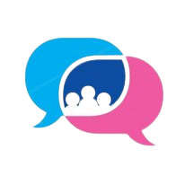

<!-- Add your project logo if you have any -->

<h1 align="center">Babble</h1>

 

 	<!-- Add your tagline or very short intro of your project -->
	A web group-chat application that filters abuse and prevents bullying
     
    Live preview : https://babble-chat-app-nk.netlify.app
     
    

 

<!-- Add your project demo gif here -->

Project's introduction here

## 🧐About

About your project

## 💡Features

1. 
1. 

## ⛏️Built with

-   
-   

## 📈Future Plans

-   

## 🎈Usage

How to use your project

## ✍️Authors

<!-- Add links to all the authors profile here OPTIONAL: You can mention what they did as well -->

-   [@author_name](profile link) - what he/she did

